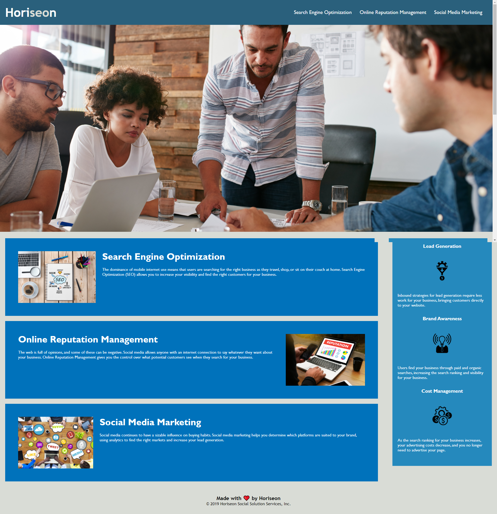

# Homework 1: Horizon-Zero

## Overview

```
The overall goal for this project was to take the line of code that was given to me and made sure it hit a few criterias

1. When you view the source code, you'll find semantic HTML elements

2. Made sure the elements followed a logical structure independant of styling and positioning

3. When you view the image elements you can find accessible alt attributes

4. When you view the heading attributes, they call in sequental order.

5. When you view the title element,, you'll find a concise, descriptive title.
```


## Website Screenshot



## Website Link to Application:
https://dextervorbe.github.io/Horizon-Zero/
